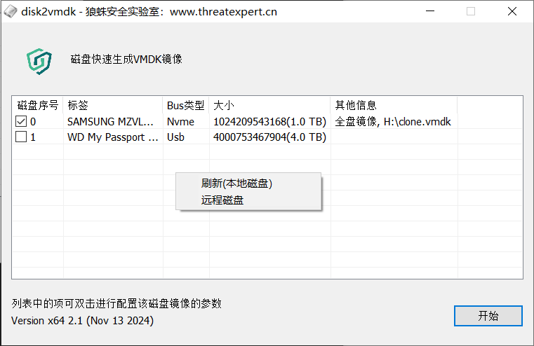

# disk2vmdk

README in [English](./README_en.md) 、 [中文](./README.md)

### 特点

1. 适应系统winxp-win11
1. 类似winhex针对挂载中的磁盘进行全盘镜像，可直接生成为vmdk格式，也可选dd格式、VHD格式和VDI格式。
1. 制作磁盘镜像时可选某个分区排除，例如只取C盘和引导分区做镜像，生成的镜像文件仍然可以虚拟机仿真启动，节省时间。
1. 可选择只备份磁盘分区中已使用的磁盘空间的数据，节省时间，注意这将无法在镜像上进行数据恢复方面的取证分析。
1. 支持通过网络制作远程的磁盘镜像

### 远程模式的应用场景和使用方法

  - 当取证者不方便物理接近目标服务器时，那么磁盘镜像就只能通过远程方式制作，还有些虚拟化云平台虽然可以给云主机创建磁盘快照镜像，但镜像的文件格式加密且特殊，仅适用该虚拟化平台，这时可以使用disk2vmdk远程制作成常用的镜像格式。
  - 使用方法很简单，把d2vagent放在远程主机上，配置密码后启动监听TCP端口。本地用disk2vmdk的远程模式和它通讯，在disk2vmdk的磁盘列表中右键，点“远程磁盘”，输入远程主机的IP端口和密码，接下来的操作就与本地模式无差别了。
  - 如果目标主机由于防火墙策列，很难开放端口，在存在RDP远程桌面访问方式的情况下，可以考虑搭配使用另一款工具[SooRDP](../../../SooRDP)，基于RDP通道来连接d2vagent。

### 其他

- 编译问题
  - VS2019，另外安装勾选组件“对VS2017(v141工具的C++ Windows XP支持)”、“MSVC v140 - VS2015 C++生成工具”、“适用于最新v142生成工具的C++ MFC（x86和x64）”

- 生成的镜像文件的只读属性问题
  - 这是为了避免意外篡改制作好的镜像文件，例如直接用vmware虚拟机启动磁盘镜像等操作是会导致镜像文件内容产生变动的。如果需要用虚拟机启动该磁盘镜像，需要在启动虚拟机前给虚拟机拍摄快照，否则由于磁盘是只读的会导致虚拟机无法开机，报错“权限不足，无法访问文件”、“打不开磁盘”、“找不到磁盘文件”等。

- VSS 和 非[全部空间]
  - disk2vmdk在使用vss选项时是对磁盘分区创建快照（还原点），然后拷贝整个快照。VSS系统快照也是只包含文件系统中存在的文件，所以和不拷贝[全部空间]的功能目的是一样的，只是两种方式。

- 当只想备份分区中已有数据时，该选VSS还是非[全部空间]?
  - 因为通常备份时间会较长，分区的数据可能频繁的变动，使用VSS的好处是备份的数据完整性较好，但稍微慢一点点。另外创建还原点时会产生一些系统日志，如果目标环境担心因为取证行为被发现导致副作用时，建议不勾选全部空间也不勾选VSS。

- vsscopy小工具
  - vsscopy的功能是方便拷贝锁定中的文件，通过VSS(Volume Shadow-copy Service)对磁盘分区做快照（还原点），然后从快照中拷贝相关文件。

- bootdump小工具
  - 提取引导启动相关的数据，例如mbr、vbr、bios固件

### License

[MIT](./LICENSE) © threatexpert.cn
