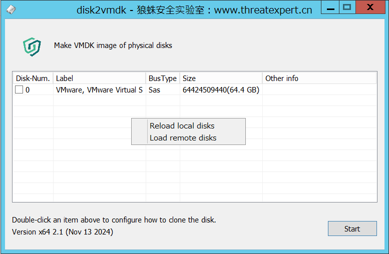

# disk2vmdk

README in [English](./README_en.md) 、 [中文](./README.md)

### Features

1. Suitable for systems winxp-win11
1. Similar to winhex, it can generate a full disk image for the mounted disk, which can be directly generated in vmdk format, and can also be selected in dd format, VHD format and VDI format.
1. When backing up the disk, you can choose to exclude a certain partition, such as only taking the C drive and the boot partition. The generated image file can still be started by virtual machine, saving time.
1. You can choose to only back up the data of the used disk space in the disk partition, saving time. Note that this will not be able to perform forensic analysis on data recovery on the image.
1. Supports making remote disk images through the network

### Application scenarios and usage of remote mode

- When it is inconvenient for the forensic collector to physically approach the target server, the disk image can only be made remotely. Some virtualization cloud platforms can create disk snapshot images for cloud hosts, but the image file format is encrypted and special, and only applicable to the virtualization platform. In this case, disk2vmdk can be used to remotely make it into a common image format.
- The usage is very simple. Put d2vagent on the remote host, configure the password and start listening on the TCP port. Use disk2vmdk's remote mode to communicate with it locally. Right-click in the disk list of disk2vmdk, click "Load remote disks", enter the IP port and password of the remote host, and the following operations are no different from the local mode.
- If the target host is difficult to open ports due to firewall policies, if there is an RDP remote desktop access method, you can consider using another tool [SooRDP](../../../SooRDP) to connect to d2vagent based on the RDP channel.

### Others

- Compilation problem
- For VS2019, install and check the components "C++ Windows XP support for VS2017 (v141 tools)", "MSVC v140 - VS2015 C++ build tools", "C++ MFC for the latest v142 build tools (x86 and x64)"

- Read-only attribute problem of the generated image file
- This is to avoid accidental tampering with the prepared image file. For example, directly starting the disk image with a vmware virtual machine will cause changes in the image file content. If you need to use a virtual machine to start the disk image, you need to take a snapshot of the virtual machine before starting the virtual machine. Otherwise, the virtual machine will not be able to start because the disk is read-only, and errors such as "Insufficient permissions, unable to access files", "Cannot open disk", "Disk file not found" will be reported.

- VSS and non-[full space]
- When disk2vmdk uses the vss option, it creates a snapshot (restore point) of the disk partition and then copies the entire snapshot. VSS system snapshots also only contain files that exist in the file system, so the function purpose is the same as not copying [full space], just two methods.

- When you only want to back up existing data in the partition, should you choose VSS or non-[full space]?
- Because the backup time is usually longer and the partition data may change frequently, the advantage of using VSS is that the backup data integrity is better, but it is a little slower. In addition, some system logs will be generated when creating a restore point. If the target environment is worried about side effects caused by the discovery of forensic behavior, it is recommended not to check all space or VSS.

- vsscopy gadget
- vsscopy is a tool that allows you to easily copy locked files, take snapshots (restore points) of disk partitions through VSS (Volume Shadow-copy Service), and then copy related files from the snapshots.

- bootdump gadget
- Extract boot-related data, such as mbr, vbr, bios firmware

### License

[MIT](./LICENSE) © threatexpert.cn